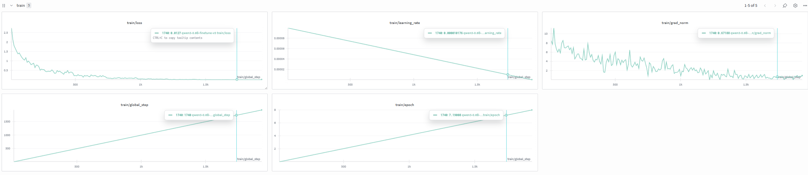
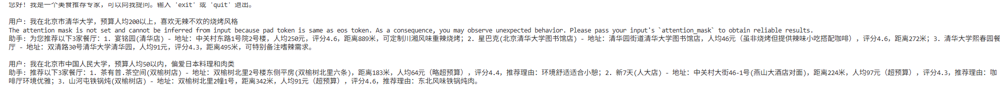
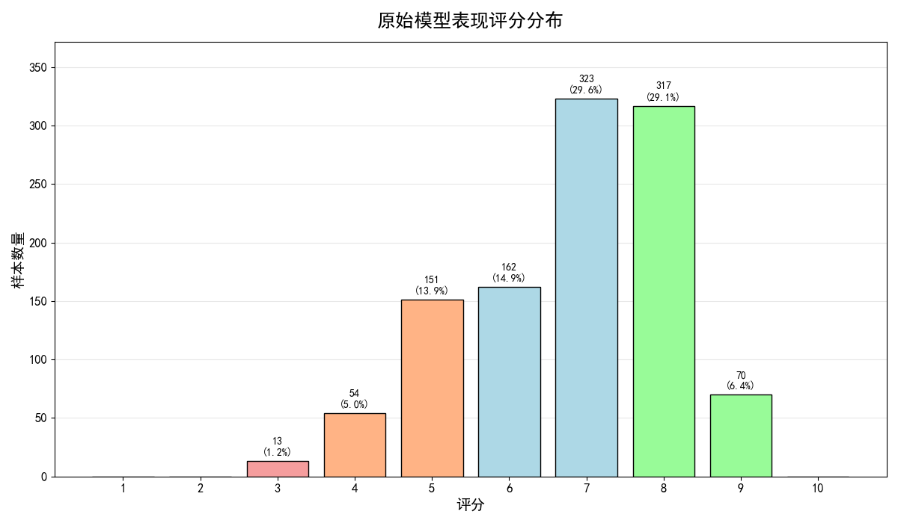

# 基于地图API数据合成与Agent协作的Qwen3微调：位置感知的AI美食推荐系统
## —— 北京理工大学 NLP 课程大作业技术报告

**团队名称：** 吃点好的
**组员姓名：** 周行健（组长）、董双屹、邹明臻

---

## 摘要 (Abstract)

大语言模型（LLM）在通用知识领域表现出色，但在处理依赖实时地理位置和特定领域实体信息的任务时，常因知识滞后或缺乏本地化数据而产生“幻觉”。本项目提出并实现了一种**基于Agent智能体合成数据并蒸馏至小模型**的完整技术路径。我们构建了一个集成高德地图API的智能体系统，自动合成了包含**真实POI**（兴趣点）信息的高质量指令微调数据集（1090条样本），并利用该数据集对轻量级模型 **Qwen3-0.6B** 进行了监督微调（SFT）。实验表明，通过构建“LLM-as-a-Judge”评估体系，合成数据质量与模型表现呈现强相关性（相关系数0.956），验证了在特定垂直领域通过智能体合成真实数据来提升小模型性能的有效性。

---

## 1. 项目背景与目标

### 1.1 问题陈述
通用大模型虽然具备强大的推理能力，但在面对通过用户的实时位置进行个性化服务（如“推荐我附近500米内的川菜馆”）时，往往无法获取实时物理世界的真实信息，且由于训练数据的截止时间限制，无法反映最新的地理商业信息。

### 1.2 创新点与目标
为了解决上述问题，同时响应课程关于“数据合成与知识蒸馏”的要求，本项目确立了以下目标：

1.  **Agent驱动的数据合成**：利用大模型作为“大脑”，通过调用高德地图API工具，生成基于真实地理信息的“Question-Answer”对，解决训练数据缺乏真实性的问题。
2.  **小模型知识蒸馏**：将Agent获取的外部知识（地图数据）和推理过程，通过微调内化到 Qwen3-0.6B 这样边缘端可部署的小模型中。
3.  **闭环评估体系**：构建基于阿里云百炼API的自动化评估流程，定量分析数据质量对模型性能的影响。

---

## 2. 系统架构 (System Architecture)

本项目采用模块化设计，主要包含三大核心模块：**数据生成模块 (Agent)**、**模型微调模块 (Fine-tune)** 和 **评估分析模块 (Evaluate)**。

```
├── generate_data/          # 数据生成模块
│   ├── agent/             # Agent智能体
│   │   └── data_generator_agent.py
│   ├── tools/             # 工具集
│   │   ├── geo_location_tool.py      # 地理位置查询
│   │   ├── restaurant_search_tool.py # 餐厅搜索
│   │   └── preference_gen_tool.py    # 偏好生成
│   ├── main.py            # 数据生成主程序
│   ├── transfer_data.py   # 数据格式转换
│   ├── data_raw.json      # 原始生成数据
│   └── data.json          # 格式化后的数据
├── fine_tune/             # 模型微调模块
│   ├── prepare_data.py    # 数据预处理
│   ├── spilit_train_test.py # 数据集划分
│   ├── train.py           # 模型训练
│   └── prediction_result.json # 模型预测结果
├── evaluate/              # 评估模块
│   ├── evaluate_bailian.py # 基于阿里云百炼的评估
│   ├── visualization.py    # 可视化脚本
│   ├── prediction_evaluate_visualization.py # 预测结果可视化
│   ├── evaluation_results.json    # 详细评估结果
│   ├── evaluation_analysis.json   # 统计分析
│   └── evaluation_report.txt      # 评估报告
└── README.md
```

### 2.1 核心技术栈
- **智能体框架**：`smolagents` (用于构建Tool-use Agent)
- **外部知识源**：高德地图 API (提供LBS服务)
- **基座模型**：Qwen3-0.6B (ModelScope下载)
- **评估引擎**：阿里云百炼 API (作为裁判模型)

---

## 3. 技术实现路径

### 3.1 智能体架构与数据合成 (Data Synthesis)
这是本项目的核心创新环节。我们并未直接爬取数据，而是构建了一个**具备规划能力的Agent**来模拟真实推荐场景。

*   **Agent大脑**：利用大模型（LiteLLM调用）理解用户意图并规划工具调用序列。
*   **工具集 (Tools)**：
    1.  `GeoLocationTool`：将自然语言地名（如“北京理工大学”）转换为经纬度坐标。
    2.  `RestaurantSearchTool`：基于坐标和搜索半径（2000米），调用高德API获取真实餐厅数据（包括名称、菜系、评分、人均消费）。
    3.  `PreferenceGenTool`：随机生成多样化的用户画像（口味偏好、预算区间），保证数据的多样性。
*   **合成流程**：
    Agent 接收到生成指令后，自主执行 `ReAct` 流程：**查询位置 -> 搜索周边餐厅 -> 生成符合偏好的推荐理由 -> 输出标准化的 JSON 格式数据**。

**数据样例：**
> **Instruction**: 根据用户位置和偏好，推荐符合要求的餐厅
> **Question**: 我在北京良乡北京理工大学，价格需求区间为50-100，偏好川菜、健康饮食
> **Answer**: 为您推荐以下餐厅：1. 川香源（川菜）... [包含真实POI信息]

### 3.2 模型微调与蒸馏 (Model Fine-tuning)
我们将Agent合成的“教师级”数据“蒸馏”给小模型。

*   **数据预处理**：编写 `prepare_data.py` 和 `transfer_data.py`，将原始JSON转换为模型所需的指令微调格式。数据集按 8:1 划分为训练集（872条）和验证集（218条）。
*   **训练配置**：
    *   模型：Qwen3-0.6B
    *   策略：全量微调（Full Fine-tuning），Batch Size=1，梯度累积4步，最大长度2048 tokens。
    *   监控：使用 Weights & Biases (WandB) 实时监控 Loss 变化。

训练数据的格式如下：

```
{
        "Instruction": "根据用户位置和偏好，推荐符合要求的餐厅",
        "Question": "我在北京市中国人民大学，预算人均100-200元，偏好东北菜、无辣不欢风格。",
        "Answer": "为您推荐以下3家餐厅：1. 山河屯铁锅炖(双榆树店) - 地址：双榆树北里2幢1号，评分4.6，距离342米，招牌麻辣锅底配大块肉食满足重口味；2. 双福园(双榆树店) - 地址：双榆树北路57号，评分4.6，距离320米，酸菜白肉锅可加辣升级，地道东北风味；3. 济州爱肉堂·双榆树店 - 地址：双榆树北里甲18号，评分4.6，距离354米，韩式烤肉搭配特制辣酱别具风味。"
    }
```

模型的训练期间的监控如下图所示：



由**loss曲线**可以看出，在我们设计的数据集上训练8个epoch可以收敛。

完成微调之后，我们加载模型并做了多轮问答，下面是模型的回答实例：



可以看出，模型能够根据用户的所处的地点和口味、预算要求，给出符合条件的推荐选项。

### 3.3 自动化评估系统 (Evaluation)

为了客观评价小模型的表现，我们设计了 `RestaurantDataEvaluator` 类。

*   **评估方法**：LLM-as-a-Judge，调用阿里云百炼的高级模型作为裁判。
*   **双维度指标**：
    1.  **数据质量 (Data Quality)**：从准确性、一致性、多样性、规范性、实用性5个维度打分（满分10分）。
    2.  **模型表现 (Model Performance)**：从理解能力、推荐合理性、信息完整性、逻辑清晰性、多样性5个维度打分（满分10分）。

---

## 4. 实验结果与分析

**4.1 数据集质量分析**

本研究构建的包含1090条样本的美食推荐指令微调数据集展现了极高的数据质量。通过对原始模型生成内容的评分评估，数据集整体呈现出“高分集中、低分长尾”的优良分布特征：

1. **整体质量优异**：数据集的平均评分达到 **6.79/10**，且评分的中位数落在7分，表明绝大多数样本均能提供有价值的参考信息。
2. **高可用性数据占比大**：评分在7分及以上的样本占据了主导地位。其中，评分在8-9分的高质量数据共有387条，占比高达 **35.5%**；若包含7分（29.6%）的样本，则有超过 **65%** 的数据被评估为质量良好或优秀。这部分数据逻辑清晰、推荐理由充分。
3. **事实准确性强**：低分段（1-3分）的样本极为稀缺，仅占总量的 **1.2%**。这一极低的错误率直接证明了在数据生成阶段引入**地图API**的有效性。API的介入确保了POI（兴趣点）信息（如店名、地址、距离、评分）的**真实性与准确性**，有效克服了纯语言模型生成数据时常见的“幻觉”问题，为后续模型的监督微调（SFT）提供了坚实可靠的数据基础。



下面给出两个原始模型的输出示例：

```
"Question": "我在北京服装学院附近，预算50-100元，喜欢川菜和吃肉",
"Answer": "推荐以下3家餐厅：1. 川寨小馆(芍药居综合楼店) - 地址：芍药居甲2号院1号楼西门旁，评分4.2，距离仅272米，主打正宗川菜，肉类菜品丰富；2. 京徽川菜 - 地址：芍药居南区东南门东北60米，评分3.4，距离294米，融合川菜与徽菜风味，肉类选择多样；3. 川师傅冒菜(对外经贸店) - 地址：太阳宫芍药居5号院1号楼，评分4.2，距离341米，人均消费29元，性价比高，可自选多种肉类食材。"
```

```
"Question": "我在北京印刷学院附近，想吃粤菜，偏爱甜食，预算控制在人均50以内。",
"Answer": "推荐以下餐厅：1. 北京印刷学院食堂 - 地址：兴华大街25号印刷学院内，评分4.4，人均20元，经济实惠且菜品多样。2. 陕味基(清源西里小区店) - 地址：清源西里32-1(清源路地铁站B东北口步行90米)，评分4.2，人均18元，虽非粤菜但有甜口选项。3. 阳阳中国饭(清源店) - 地址：清源西里34-2(清源地铁站B出口)，评分4.6，人均26元，部分菜品偏甜可尝试。",
```

##### 1. 样例分析

##### **第一个示例（正面案例：多约束完美匹配）**

- ##### **用户需求**：北京服装学院（位置）+ 50-100元（预算）+ 川菜（菜系）+ 吃肉（具体偏好）。

- **模型表现**：**优秀**。

- **分析**：

  - ##### **精准命中所有约束**：推荐的三家餐厅（川寨小馆、京徽川菜、川师傅冒菜）在菜系上完全符合“川菜”这一硬性要求。

  - **偏好理解到位**：模型不仅找到了餐厅，还在推荐理由中特意强调了“肉类菜品丰富”、“肉类选择多样”，完美响应了用户“喜欢吃肉”的个性化指令。

  - **地理位置准确**：结合了Map API，距离都在350米以内，非常精准。

- **结论**：当候选池中有充足的符合条件数据时，原始模型能很好地完成检索和推荐任务。

##### **第二个示例（负面案例：硬约束失效与强行推荐）**

- **用户需求**：北京印刷学院（位置）+ 人均50以内（预算）+ **粤菜（菜系）** + 偏爱甜食（具体偏好）。
- **模型表现**：**不合格**。
- **分析**：
  - **核心约束丢失（Fatal Error）**：用户明确要求“粤菜”，但推荐的三个结果中：
    - 第1个是“食堂”（通常是混合菜系，不够垂直）；
    - 第2个是“陕味基”（明显是陕西菜/快餐，与粤菜南辕北辙）；
    - 第3个是“阳阳中国饭”（中式快餐，非粤菜）。
    - **模型甚至在理由中自认失败**：在推荐“陕味基”时，模型写道“虽非粤菜但有甜口选项”。这说明模型意识到了菜系不匹配，但为了凑够数量或距离最近，牺牲了准确性。
  - **权重判断错误**：模型错误地认为“距离近”和“有甜食”的权重高于“是粤菜”。它试图用“有甜口选项”来弥补菜系的不对版，这不符合人类寻找餐厅的逻辑（想吃粤菜时，陕西肉夹馍再甜也不是替代品）。
  - **检索范围局限**：可能因为该地点附近确实没有低价粤菜，模型没有选择扩大搜索范围或诚实告知，而是选择了“强行推荐”不相关的餐厅。

------


##### 2. 原始模型的缺点总结（针对性分析）

通过对比这两个例子，我们可以总结出原始模型存在的三个主要问题，这也是你微调的动机所在：

##### **A. 对“硬约束”的约束感不足 (Weak Constraint Satisfaction)**

原始模型往往将用户的要求视为“建议”而非“限制”。
在第二个例子中，“粤菜”是一个硬约束。如果附近没有粤菜，模型不应该推荐陕西菜。原始模型倾向于**“只要位置对，什么店都能推”**，导致在垂直领域（特定菜系）的推荐精准度大幅下降。

##### **B. 缺乏“拒绝回答”或“扩大搜索”的智能逻辑**

当检索系统（Map API）在“北京印刷学院+50元内+粤菜”的条件下返回空结果或结果极少时，原始模型不知道该如何处理。

- **理想行为**：告诉用户“附近50元内没有找到粤菜，为您推荐稍微远一点的XXX”或者“为您推荐附近的甜品店”。
- **原始模型行为**：为了完成“推荐3家”的任务，抓取了仅仅满足位置和价格条件的“陕味基”来凑数，导致回复质量极低。

##### **C. 推荐理由的逻辑牵强 (Hallucinated Relevance)**

为了让错误的推荐看起来合理，模型会编造或牵强附会理由。
例如在推荐陕西菜时强调“有甜口选项”来迎合用户“偏爱甜食”的需求。这种**“避重就轻”**的生成方式，虽然在语言通顺度上没问题，但在实际应用中会给用户带来极差的体验（误导用户）。


### 4.2 模型性能评估

经过8个Epoch的微调，Qwen3-0.6B 在特定任务上取得了显著进步。
*   **平均得分**：**6.64/10**。
*   **分布情况**：7-8分的回答占比 **63.4%**，说明小模型已经成功学会了推荐逻辑和格式规范，能够准确复述地理位置信息。


---

## 5. 总结与展望

本项目成功实现了一个端到端的 **“Agent数据合成 -> 小模型微调”** 系统。

1.  **验证了技术闭环**：证明了利用Agent工具调用能力获取外部知识（高德地图），并将其内化到小模型权重的路径是可行的。
2.  **低成本高性能**：仅使用0.6B参数量的模型，配合高质量的合成数据，即可在特定垂直领域（LBS美食推荐）达到可用的效果，具有极高的端侧部署潜力。
3.  **未来工作**：计划使用多模态模型作为agent主干模型，对高德API提供的餐厅的图片信息进行解读，进一步增强训练数据的信息量。

---

## 6. 成员分工

*   **周行健 (组长)**：负责项目整体架构设计和Agent开发；开发 `generate_data` 模块，实现基于 `smolagents` 和高德地图API的智能体数据合成系统；撰写技术报告核心章节。
*   **董双屹**：负责 `fine_tune` 模块，搭建 Qwen3 模型微调流水线，包括数据预处理、模型训练脚本编写及超参数调试；技术报告`fine_tune` 模块报告撰写。

*   **邹明臻**：负责 `evaluate` 模块及可视化，开发基于阿里云百炼的评估脚本，进行实验数据分析与图表绘制；技术报告`evaluate` 模块报告撰写。
